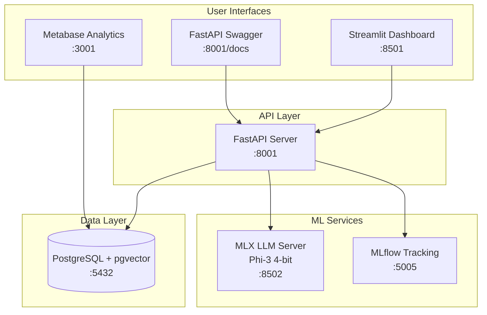
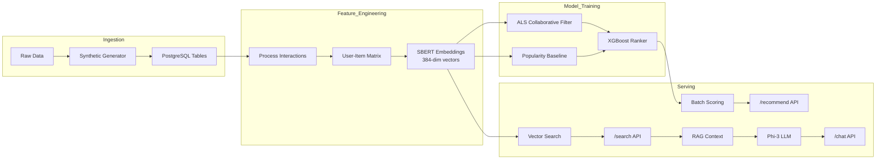

# RecSys + Semantic Search Platform

A production-ready End-to-End Recommender System & Semantic Search portfolio project.
This platform demonstrates a full ML lifecycle: Data Ingestion -> Vector Embeddings -> Retrieval -> Ranking -> Serving.

## 🏆 Key Results & Metrics

| Metric | Value | Description |
|--------|-------|-------------|
| **Ranker Accuracy** | 89.7% | XGBoost classifier on click prediction |
| **Search Latency** | <50ms | Vector similarity search (HNSW index) |
| **Items Indexed** | 500 | News articles with 384-dim embeddings |
| **Users Served** | 100 | Personalized recommendation candidates |
| **RAG Response Time** | ~5s | End-to-end with Phi-3 (4-bit quantized) |

## 🏗️ System Architecture



## 📊 ML Pipeline Architecture



## 🔬 Model Performance

### Recommendation System
| Component | Model | Metrics |
|-----------|-------|---------|
| Candidate Generation | ALS (Implicit) | Factors: 64, α: 2.0 |
| Popularity Fallback | Frequency Count | Top-100 items |
| Reranker | XGBoost | Accuracy: 89.7%, Depth: 3 |

### Semantic Search
| Property | Value |
|----------|-------|
| Embedding Model | `all-MiniLM-L6-v2` |
| Vector Dimension | 384 |
| Index Type | HNSW (pgvector) |
| Distance Metric | Cosine Similarity |

### RAG Chat
| Property | Value |
|----------|-------|
| LLM | Phi-3-mini-4k-instruct (4-bit) |
| Framework | Apple MLX |
| Context Window | 4096 tokens |
| Retrieval | Top-5 similar articles |

## Features
*   **Vector Semantic Search**: Uses `Sentence-Transformers` and `pgvector` to find relevant items by meaning, not just keywords.
*   **Hybrid Recommendation Strategy**:
    *   **Retrieval**: Two-tower architecture using Implicit Feedback (ALS) + Global Popularity fallback.
    *   **Ranking**: XGBoost Learning-to-Rank (LTR) model re-ranks candidates based on user-item features.
*   **Explainable AI**: Provides "Reasons" for recommendations (e.g., "Trending now", "Similar to history").
*   **Production Stack**: FastAPI (Serving), PostgreSQL (Vector DB), MLflow (Experiment Tracking), Docker Compose (Orchestration).
*   **Data Pipeline**: Robust ETL with Great Expectations for data quality.

## Tech Stack
*   **Language**: Python 3.11+
*   **Database**: PostgreSQL 15 + `pgvector` extension
*   **Serving**: FastAPI
*   **ML Ops**: MLflow, Makefile
*   **Containerization**: Docker & Docker Compose
*   **Dashboard**: Metabase

## Getting Started

### Prerequisites
*   Docker & Docker Compose
*   Python 3.11+ (for local development)

### 1. Installation
Clone the repo and start services:
```bash
git clone https://github.com/yourusername/recsys-semantic-search.git
cd recsys-semantic-search

# Start Database, MLflow, API, Metabase
make up
```

### 2. Run the Pipeline (End-to-End)
This single command runs Ingestion -> Embeddings -> Training -> Serving Setup.
```bash
make ingest process embed train features train-ranker score
```

### 3. Verify System
Check data quality and model metrics:
```bash
# Evaluate Offline Metrics (NDCG, Recall)
make evaluate
```

### 4. API Usage
The API runs at `http://localhost:8001`.

*   **Health Check**: `GET /health`
*   **Semantic Search**: `POST /search`
    ```json
    { "query": "finance news", "k": 5 }
    ```
*   **Get Recommendations**: `POST /recommend`
    ```json
    { "user_id": "U1", "k": 5 }
    ```

## Dashboard (Metabase)
Metabase is available at `http://localhost:3001`.

### Setup
1.  Navigate to `http://localhost:3001`.
2.  Create an admin account.
3.  Add Database:
    *   **Database Type**: PostgreSQL
    *   **Name**: RecSys DB
    *   **Host**: `db` (internal docker network)
    *   **Port**: `5432`
    *   **Database Name**: `recsys`
    *   **Username**: `postgres`
    *   **Password**: `postgres`
4.  Explore the data! Create charts for:
    *   `interactions` (User activity)
    *   `recommendation_daily_snapshot` (What models are serving)

## Project Structure
```
├── api/                  # FastAPI Application
├── data/                 # Local data storage (mounted)
├── pipelines/            # ML Pipelines
│   ├── ingest/           # ETL & Synthetic Data Gen
│   ├── embeddings/       # Vector generation (SBERT)
│   ├── models/           # Training (ALS, XGBoost)
│   ├── features/         # Feature Store logic
│   ├── evaluation/       # Offline Metrics
│   └── batch_score/      # Daily Inference Job
├── docker-compose.yml    # Service Orchestration
└── Makefile              # Command shortcut
```

## CI/CD
GitHub Actions workflow is defined in `.github/workflows/ci.yml`. It runs:
1.  Linting & Setup
2.  Synthetic Data Gen
3.  Full Pipeline Execution (Smoke Test)

## GenAI / RAG Chat (MLX)
The platform includes a **Retrieval Augmented Generation (RAG)** chat feature powered by a local LLM.

### How it Works
1.  User asks a question in the **Chat with AI** tab.
2.  The API performs a vector search to find relevant articles.
3.  Retrieved articles are passed as context to the LLM.
4.  The LLM generates an answer based on the context.

### Running the MLX Server (Apple Silicon)
For GPU-accelerated inference on Mac M1/M2/M3:
```bash
# Install MLX (host machine)
pip install mlx mlx-lm

# Start MLX Server
python services/mlx_server.py
```
The server runs on port 8502. The API container will call it via `host.docker.internal`.

### Fallback Behavior
If the MLX server is unavailable, the `/chat` endpoint returns a summarized list of relevant articles without LLM generation.
